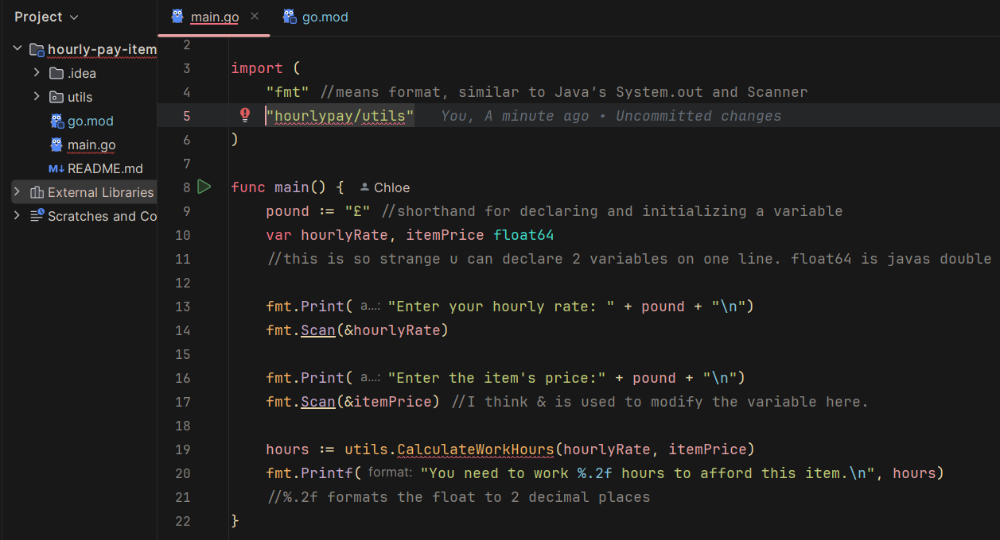
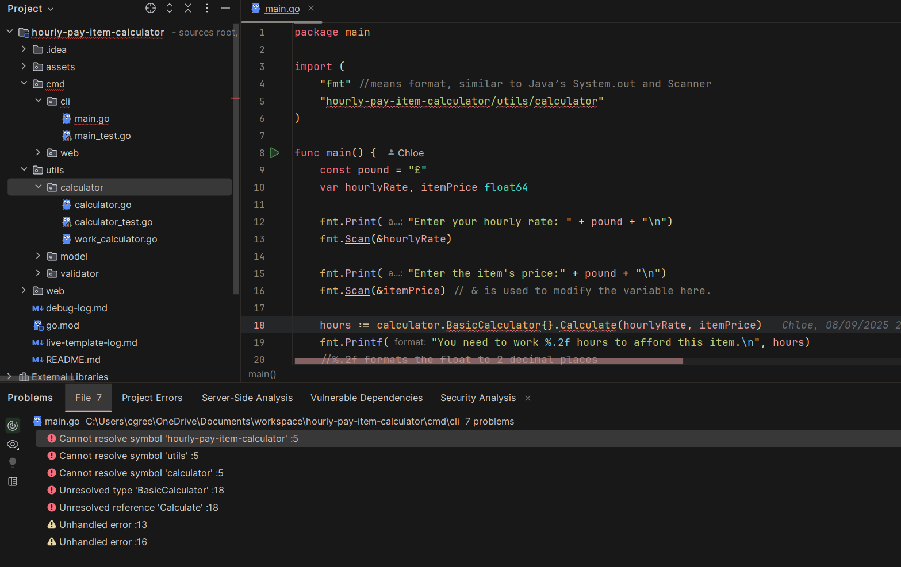

# 🐞 Debugging Log:

#### This file is my personal debugging log while learning Go. I’m keeping things organised in a table, so I can easily look back at what went wrong, what I tried, and what actually fixed it. It’s super helpful for revising past issues and spotting patterns—especially since I’m coming from a Java background, where things like package visibility and module imports work totally differently. I’m using this to track my progress, learn from my mistakes, and hopefully build a little reference that might help others who hit the same bumps early on.

| Bug ID | Problem                                                                                                                                                                                                                                                                                                                                          | Steps Taken                                                                                                                                                                                                                                                                                                                                                                                                                                       | Solution                                                                                                                                                                                                                                | Lessons Learnt                                                                                                                                                                  | Evidence                                    |
|--------|--------------------------------------------------------------------------------------------------------------------------------------------------------------------------------------------------------------------------------------------------------------------------------------------------------------------------------------------------|---------------------------------------------------------------------------------------------------------------------------------------------------------------------------------------------------------------------------------------------------------------------------------------------------------------------------------------------------------------------------------------------------------------------------------------------------|-----------------------------------------------------------------------------------------------------------------------------------------------------------------------------------------------------------------------------------------|---------------------------------------------------------------------------------------------------------------------------------------------------------------------------------|---------------------------------------------|
| #001   | IntelliJ was flagging an error in my `main.go` file, unable to resolve the local package import `"hourlypay/main.model.utils"`, even though the code compiled and ran correctly via the terminal.                                                                                                                                                | Reformatted generated Go Module name. Capitalised function name for pubic local use. Researched GOLand and GOPath issues. Tried a shorthand reference                                                                                                                                                                                                                                                                                             | Verified folder structure, enabled Go Modules Integration, invalidated caches, restarted IDE. Updated import path to `"hourly-pay-item-calculator/main.model.utils"` to match `go.mod` module name                                      | Go import paths must match the module name in `go.mod`; IDEs need proper module integration settings                                                                            |  |
| #002   | After refactoring my Go project into a modular structure with nested folders (e.g. `entry/cli`, `internal/calculator`, `web/handlers`), my imports started breaking. Go couldn’t resolve packages like `hourly-pay-item-calculator/internal/calculator`, and I kept getting errors like “package not in std” or “multiple packages in directory. | Moved CLI and web entry points into separate folders (`entry/cli`, `entry/web`) and gave each a main.go file with package main.                                                                                                                                                                                                                                                                                                                   | Verified that the go.mod file declared the correct module name: hourly-pay-item-calculator and starting from the internal class with the least dependencies I updated the import paths                                                  | Go imports are tightly coupled to the module name in go.mod and the relative position of the file —they’re not relative like in Java.                                           |                                             |
| #003   | IntelliJ was showing unresolved references for valid functions like Calculate() in BasicCalculator, even though the interface itself was recognized and the app compiled and ran perfectly via the terminal and IDE. This was very confusing as I attempted to fix the broken imports before continuing development.                             | After noticing that the CLI app ran perfectly despite IntelliJ showing unresolved references, I ruled out issues with Go itself and focused on the IDE. I verified that the go.mod module name matched all import paths, confirmed correct package declarations and folder structure, and ran go mod tidy to clean up dependencies. I invalidated IntelliJ’s caches, restarted the IDE, and rebuilt the project—none of which resolved the issue. | Forced IntelliJ to reindex the file containing the Calculate() method by manually editing and saving it. This resolved the false error and restored full symbol recognition. The app was always working—IntelliJ just hadn’t caught up. | Manual edits to a file can trigger reindexing and resolve lingering symbol resolution bugs. Trust the terminal and Go’s compiler over the IDE when things don’t add up visually |  |
